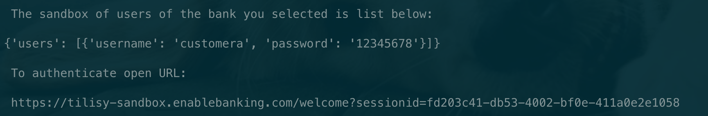
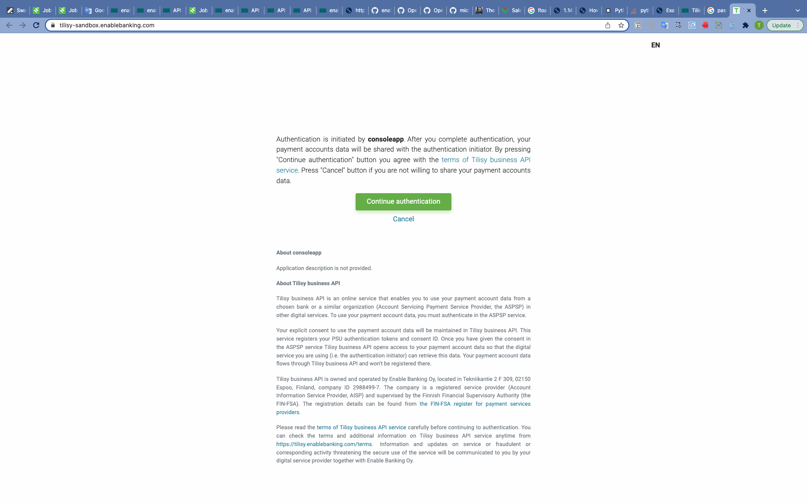

<div id="top"></div>

# Console application with Tilisy API


This is a console application used for test task for Junior Software Engineer role at Enable banking oy. This application would allow a user to fetch their own bank transactions for the last 30 days and output a short summary of the operations for each of the user’s bank accounts.

[Tilisy API](https://enablebanking.com/docs/tilisy/latest/#tilisy-api) is the integrated Open Banking APIs of of all major banks in Nordics and Baltics provided by [Enable Banking Oy](https://enablebanking.com/). The APIs could used for [user authentication](https://enablebanking.com/docs/tilisy/latest/#start-user-authorization), [user session authentication](https://enablebanking.com/docs/tilisy/latest/#authorize-user-session), and retrieving [balances](https://enablebanking.com/docs/tilisy/latest/#get-account-balances) and [transactions](https://enablebanking.com/docs/tilisy/latest/#get-account-transactions) data in a user-friendly manner.

- [Installation](#installation)
- [Application Registration](#application-registration)
- [Usage](#usage)
- [Resources](#resources)

## Installation

Verify that you have the following prerequisites in place before installing the application:

- Install Python from [https://www.python.org/](https://www.python.org/). You'll need Python 3.6 or later.

- This application requires an application registered at [here](https://enablebanking.com/cp/applications).

Follow these steps to install the sample code on your computer:

1. Clone the repo with this command:

   ```sh
   git clone https://github.com/ting-chen-cn/consoleAppTilisyApi.git
   cd consoleAppTilisyApi
   ```

2. Create and activate a virtual environment.

   ```sh
   python3 -m venv venv
   source venv/bin/activate
   ```

3. In the root folder of your cloned repo, install the dependencies for the sample as listed in the `requirements.txt` file with this command:
   ```sh
   pip install -r requirements.txt
   ```

<p align="right">(<a href="#top">back to top</a>)</p>

## Application Registration

To run the sample, you will need to register an application and add the registered application's ID to the configuration information in the [config.py](https://github.com/microsoftgraph/python-sample-console-app/blob/master/helpers.py) file. Follow these steps to register and configure your application:

1. Create a developer account at [here](https://enablebanking.com/sign-in/).

2. Register a new application at [here](https://enablebanking.com/cp/applications).

- Generate key pairs

```sh
   openssl genrsa -out private.key 4096
   openssl rsa -in private.key -pubout -out public.pem
```

- Upload the `public.pem` in the registration form.

3. Modify `keyPath` and `applicationId` variables in the `config.json` file in the root of this
   project with the values obtained from previous step.

<p align="right">(<a href="#top">back to top</a>)</p>

## Usage

Follow these steps to run the sample app:

1. Activate the virtual environment, for example in windows run the below command
   ```sh
   source venv/bin/activate
   ```
2. Launch the application

   ```sh
   python main.py
   ```

   You will see the available banks list from which you can select the bank.

   ```
   <---------------- Available banks list ---------------->
   '  index                 name                country   '
   '  0                    Argenta                   BE   '
   '  1                   Citadele                   EE   '
   '  2                   Citadele                   LT   '
   '  3                   Citadele                   LV   '
   '  4                    Nordea                    DK   '
   '  5                    Nordea                    FI   '
   '  6                    Nordea                    NO   '
   '  7                    Nordea                    SE   '
   '  8                   Swedbank                   EE   '
   '  9                   Swedbank                   LT   '
   '  10                  Swedbank                   LV   '
   '  11            Bergslagens Sparbank             SE   '
   '  12              Bjursås Sparbank               SE   '
   '  13             Dalslands Sparbank              SE   '
   '  14               Ekeby Sparbank                SE   '
   '  15            Falkenbergs Sparbank             SE   '
   '  16            Fryksdalens Sparbank             SE   '
   '  17            Hälsinglands Sparbank            SE   '
   '  18         Häradssparbanken Mönsterås          SE   '
   '  19               Högsby Sparbank               SE   '
   '  20        Ivetofta Sparbank i Bromölla         SE   '
   '  21             Kinda-Ydre Sparbank             SE   '
   '  22              Laholms Sparbank               SE   '
   '  23             Lekebergs Sparbank              SE   '
   '  24              Leksands Sparbank              SE   '
   '  25        Lönneberga-Tuna-Vena Sparbank        SE   '
   '  26             Markaryds Sparbank              SE   '
   '  27              Mjöbäcks Sparbank              SE   '
   '  28             Norrbärke Sparbank              SE   '
   '  29               Orusts Sparbank               SE   '
   '  30             Roslagens Sparbank              SE   '
   '  31                Sala Sparbank                SE   '
   '  32              Sidensjö Sparbank              SE   '
   '  33              Skurups Sparbank               SE   '
   '  34          Snapphanebygdens Sparbank          SE   '
   '  35             Sparbanken Alingsås             SE   '
   '  36              Sparbanken Boken               SE   '
   '  37               Sparbanken Eken               SE   '
   '  38              Sparbanken Göinge              SE   '
   '  39            Sparbanken i Enköping            SE   '
   '  40           Sparbanken i Karlshamn            SE   '
   '  41            Sparbanken Lidköping             SE   '
   '  42               Sparbanken Nord               SE   '
   '  43             Sparbanken Rekarne              SE   '
   '  44             Sparbanken Sjuhärad             SE   '
   '  45            Sparbanken Skaraborg             SE   '
   '  46              Sparbanken Skåne               SE   '
   '  47              Sparbanken Tanum               SE   '
   '  48             Sparbanken Tranemo              SE   '
   '  49        Sparbanken Västra Mälardalen         SE   '
   '  50                  Swedbank                   SE   '
   '  51           Södra Dalarnas Sparbank           SE   '
   '  52            Södra Hestra Sparbank            SE   '
   '  53         Sölvesborg-Mjällby Sparbank         SE   '
   '  54             Sörmlands Sparbank              SE   '
   '  55             Tidaholms Sparbank              SE   '
   '  56            Tjustbygdens Sparbank            SE   '
   '  57               Tjörns Sparbank               SE   '
   '  58            Ulricehamns Sparbank             SE   '
   '  59              Vadstena Sparbank              SE   '
   '  60           Valdemarsviks Sparbank            SE   '
   '  61              Varbergs Sparbank              SE   '
   '  62              Vimmerby Sparbank              SE   '
   '  63             Virserums Sparbank              SE   '
   '  64          Westra Wermlands Sparbank          SE   '
   '  65               Ålems Sparbank                SE   '
   '  66             Åse Viste Sparbank              SE   '
   '  67            Åtvidabergs Sparbank             SE   '
   '  68                 Ölands Bank                 SE   '
   '  69                  S-Pankki                   FI   '
   '  70                   Revolut                   EE   '
   '  71                   Revolut                   ES   '
   '  72                   Revolut                   FI   '
   '  73                   Revolut                   LT   '
   '  74                   Revolut                   LV   '
   '  75                   Revolut                   SE   '
   '  76                   Revolut                   DK   '
   '  77                   Revolut                   NO   '
   '  78                   Revolut                   PL   '
   '  79                   Revolut                   BE   '
   '  80                   Revolut                   NL   '
   '  81                Handelsbanken                FI   '
   '  82                Handelsbanken                SE   '
   '  83                Handelsbanken                NL   '
   '  84                  Coop Pank                  EE   '
   '  85                Vestjysk Bank                DK   '
   '  86                 Mock ASPSP                  FI   '
   '  87                 Mock ASPSP                  SE   '
   '  88                 Mock ASPSP                  DE   '
   '  89                 Mock ASPSP                  NO   '
   '  90                  Rabobank                   NL   '
   <------------------------------------------------------>
   ```

3. Input the index of the bank you want to choose or just type q to quit the application.
   

4. If the input index is in the range list before, then the application will print the users inforation and the URL for user authentication.
   

5. You should paste the link in a web browser and follow the instructions to complete the authentication and authorise access to the bank data. Below is an example of authentication process for S-Pankki bank.
   

6. After the seccessful authorisation, you need copy and paste the redirect URL back to the application. Then the summary of for each account will be displayed as below.

```
<---------------------- Summary of transactions ---------------------->
account iban         numbers   maximum    credit    debit     currency

FI7473834510057469      40      150.27    247.58    330.76         EUR
FI6593857450293470      40      146.81    193.31    569.27         EUR
empty iban              40       2.01      0.00     40.75          EUR
<--------------------------------------------------------------------->
```

> **NOTE:** If the accout iban is an empty string, then it will be replaced to 'empty iban' in the summary report.

<p align="right">(<a href="#top">back to top</a>)</p>

## Resources

- [Python sample code for Tilisy API](https://github.com/enablebanking/tilisy-api-samples/tree/master/python_example)
- [Official documentation for Tilisy API ](https://enablebanking.com/docs/tilisy/latest/#tilisy-api)

<p align="right">(<a href="#top">back to top</a>)</p>
